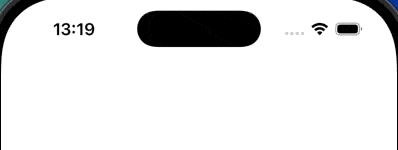
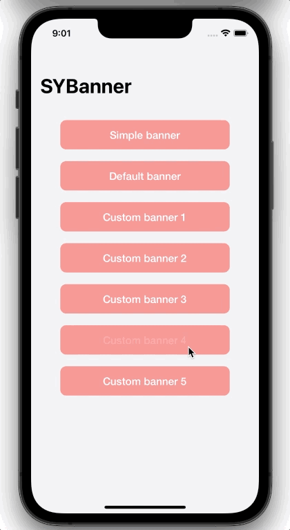
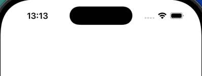

## SYBanner
</div>


----

<br>
<p>
  <samp>
A minimalistic looking banner library for iOS. It supports multiple customizable kinds of Banner types
  </samp>
</p>

<div align="center">





</div>


### Quick start

###### SYSimpleBanner



```swift
let banner = SYSimpleBanner("Link copied", backgroundColor: .white, direction: .top)
banner.animationDurationDisappear = 0.1
banner.show()
```


###### SYDefaultBanner:


```swift
let textBanner = SYDefaultBanner("A Banner with just a text", direction: .top, style: .none)
textBanner.animationDurationDisappear = 0.1
textBanner.show()

let styleBanner = SYDefaultBanner("A Banner with just a text", direction: .top, style: .success)
styleBanner.show(queuePosition: .front)
```

###### SYCardBanner


```swift
let banner = SYCardBanner(title: "How to use", subtitle: "Simple download Notification banner and get started with your own notifcations")
banner.addButton(SYCardBannerButton(title: "Skip ", style: .dismiss)
banner.addButton(SYCardBannerButton(title: "Get started", style: .default, handler: {
    // Do something on button press
}))

// See Banner options for more
banner.setBannerOptions([
  .showExitButton(true),
  .customView(yourCustomView()),
  .buttonAxis(.horizontal),
  .titleFont(UIFont.systemFont(ofSize: 35, weight: .medium)),
  .titleColor(.gray),
  .buttonsHeight(50),
  .customViewInsets(.init(top: 20, left: 0, bottom: 40, right: 0)),
])

banner.dismissOnSwipe = false
banner.show()
```

By default each banner is placed at the at the end of the queue. If your want to display the banner immediately place it at the front of the queue:
```swift
banner.show(queuePosition: .front)
```

By default each banner will be dismissed after a time. If you want to disable that, set `autoDismiss` to `false` and dismiss manually:
```swift
banner.dismissView()
```

###### SYBannerButton Style
Currently there are only 2 Button style options. Defaults is the default iOS Button with the default or the specified tint color. <br>
The dismiss style dismisses the banner when pressed and does not have a tint color.
```swift
public enum Style : Int {
  case `default` = 0
  case dismiss = 1
}
```

###### Delegate

To respond to animation events, implement the `SYBannerDelegate` protocol in your class, e.g. a View Controller, and then set the banners `delegate` property:

```swift
class MyViewController: UIViewController, SYBannerDelegate {
  override func viewDidLoad() {
    let banner = SYSimpleBanner("Link copied", direction: .top)
    banner.delegate = self
    banner.show()
  }

  // Banner delegate
  func notificationBannerWillAppear(_ banner: SYBaseBanner) {
    // Do something before the banner appears
  }

  func notificationBannerDidAppear(_ banner: SYBaseBanner) {
    // Do something when the banner appeared
  }
  func notificationBannerWillDisappear(_ banner: SYBaseBanner) {
    // Do something before the banner disappears
  }

  func notificationBannerDidDisappear(_ banner: SYBaseBanner) {
    // Do something after the banner disappeared
  }
}
```
###### User interaction

To respond to animation events, implement the `SYBannerDelegate` protocol in your class, e.g. a View Controller, and then set the banners `delegate` property:

```swift
banner.onSwipe = {
    // Do something on swipe
}
```

```swift
banner.didTap = {
    // Do something on tap
}
```

### Banner options

Banner Options

| Option Name                   | Description                                                                                                                                                                                                 |
|-------------------------------|-------------------------------------------------------------------------------------------------------------------------------------------------------------------------------------------------------------|
| `direction`          | The direction of the banner (`Direction`, default `.bottom`)                                                                                                                                                |
| `isDisplaying`                   | Flag indicating if the banner is currently displaying                                                                                                                                                          |
| `hasBeenSeen`                 | Flag indicated whether if the banner has been seen
| `bannerType`                 | Type of the Banner (`SYBannerType`, default `.float`)
| `parentViewController`                    | The view controller to display the banner on. This is useful if you are wanting to display a banner only on one ViewController and not on the whole screen
| `delegate`                 | The delegate of the banner (`.SYBannerDelegate`)                                                                                           |
| `animationDurationShow`          | Animation duration of the notification for appearing (`CGFloat`, default `0.5`)     
| `animationDurationDisappear`          | Animation duration of the notification for disappearing (`CGFloat`, default `0.5`)                                                                   
| `appearanceDuration`          | Duration for whole long the notification should appear on the screen (`Timeinterval`, default `5`)                                                                            |
| `bannerQueue`                 | Responsible for positioning and auto managing notification banners  (`SYBannerQueue`, default `.default`)
| `autoDismiss`                 | If false, the banner will not be dismissed until it is programmatically dismissed (`Bool`, default `true`)
| `dismissOnTap`                 | If true, notification will dismissed when tapped (`Bool`, default `true`)
| `dismissOnSwipe`          | If true, notification will dismissed when swiped up (`Bool`, default `true`)
| `onSwipe`          | Closure that will be executed if the notification banner is swiped up (`(() -> Void)?`, default `nil`)                                                                      
| `didTap`          | Closure that will be executed if the notification banner is tapped (`(() -> Void)?`, default `nil`)                                                                          |
| `transparency` | The transparency of the background of the notification banner (`CGFloat`, default `1` )                                                                                         |
| `haptic`                   |The type of haptic to generate when a banner is displayed (`FeedbackStyle?`, default `.medium`)                                                                  |

SYSimpleBanner, SYDefaultBanner:

| Option Name                   | Description                                                                                                                                                                                                 |
|-------------------------------|-------------------------------------------------------------------------------------------------------------------------------------------------------------------------------------------------------------|
| `message`          | The message of the notification                                                                                                                                                |
| `messageColor`                   | Color of the message label (`UIColor`, default `.label`)                                                                                                                                                          |
| `messageFont`                 | Font of the message label (`UIFont`, default `.systemFont(ofSize: 16)`)
| `messageInsets`                 | Insets of the label inside the banner  (`UIEdgeInsets`, default `.init(top: 10, left: 30, bottom: 10, right: 30)`)

SYDefaultBanner:

| Option Name                   | Description                                                                                                                                                                                                 |
|-------------------------------|-------------------------------------------------------------------------------------------------------------------------------------------------------------------------------------------------------------|
| `imageView`          | The imageView for the banner will either be set based on the style or the custom icon                                                                                                                                                |
| `customIcon`                   | Custom icon for the notification. If none is set the icon of the Notification style will be selected                                                                                        |
| `customBackgroundColor`                 | Custom icon for the notification. If none is set the icon of the Notification type will be selected
| `iconSize`                 | The size of the icon  (`CGSize`, default `.init(width: 30, height: 30)`)
| `style`                 | The style for the banner

SYCardBanner:

| Option Name                   | Description                                                                                                                                                                                                 |
|-------------------------------|-------------------------------------------------------------------------------------------------------------------------------------------------------------------------------------------------------------|
| `titleSubtitleSpacing`          | Spacing between title and subtitle (`CGFloat`, default `16`)                                                                                                                                                |
| `keyboardSpacing`                   | Spacing between the view and the keyboard, if shown (`CGFloat`, default `10`)                                                                           |
| `dismissableOrigin`                   | The number of drag necessary for the view to be dismissed. Only works if isDismissable is set to true (`CGFloat`, default `100`) |
| `isDraggable`                   |  If true, the banner can be moved around. (`Bool`, default `true`) |
| `addExitButton`                   |  If set to true, a exit button will be drawn on the top right corner (`Bool`, default `false`) |
| `exitButtonSize`                   |  The size of the top right exit button. Only visible if addExitButton is true (`CGSize`, default `init(width: 9, height: 9)`) |
| `customView`                   |  If true, the banner can be moved around. (`Bool`, default `true`) |
| `didTapButton`          | Closure that will be executed if a button is tapped (`((_ : SYCardBannerButton) -> Void)?`, default `nil`)                                                                      
| `didTapExitButton`          | Closure that will be executed if the exit button is tapped (`(() -> Void)?`, default `nil`)                                                                          |


### Requirements
- Xcode 11
- iOS 13 or later
- Swift 5 or later


### Installation

##### CocoaPods

You can use CocoaPods to install SYBanner by adding it to your Podfile:

    pod 'SYBanner'

##### Installing SYBanner manually
1. Download SYBanner.zip from the last release and extract its content in your project's folder.
2. From the Xcode project, choose Add Files to ... from the File menu and add the extracted files.

### Contribute
Contributions are highly appreciated! To submit one:
1. Fork
2. Commit changes to a branch in your fork
3. Push your code and make a pull request
